# General descrition of this project
This repository consist of a results of ETL project using S3 and Snowflake.

## Goal of this repository:
- Practice ETL process using S3 & Snowflake
- Practice integration between S3 and Snowflake
- Explore Snowflake's features like: Streams, Tasks, Stored Procedures etc. 

### Repository contains:
1. Scripts used in this project
2. Documented the whole work done in this project 

### What was done in this repo:
1. Creation of Tables in two schemas (with a transformation to Star Schema in DATA_MART)
2. Creation of Integration between Snowflake & S3 
4. Creation of Stored Procedures that move and transform data S3 -> CORE_DWH -> DATA_MART
5. Creation of Streams in Snowflake to observe changes done in tables
6. Creation of Tasks that will trigger whole ETL process

# Documented the whole work:

### Setup AWS
1.  Creation of S3 to put there files
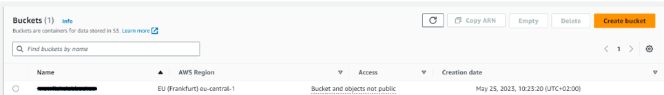

2.  Creation of policies to integrate S3 with Snowflake
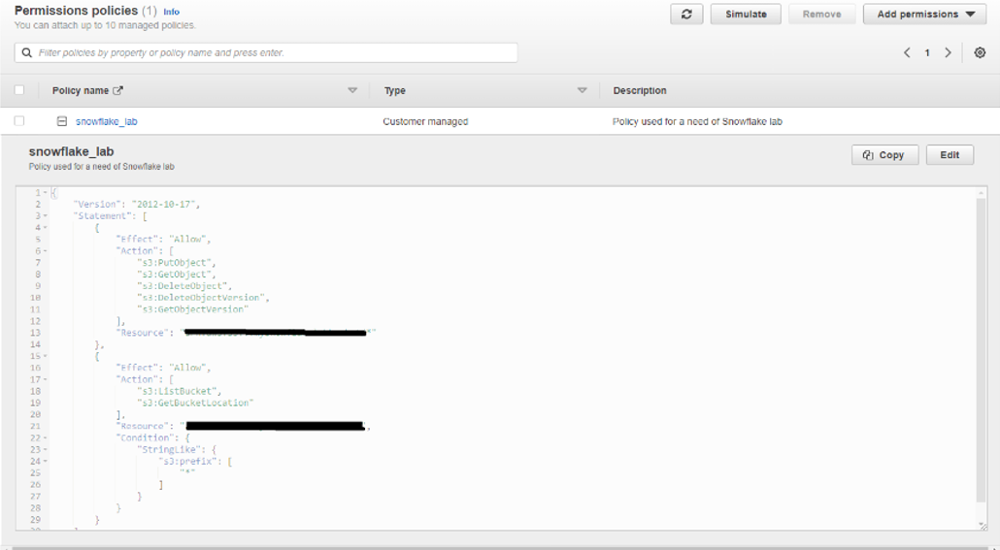

3.  Creation of role for Snowflake
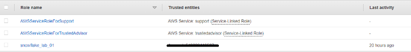

4.  Assigning created policy to the role
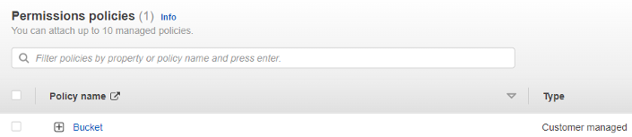

### Setup Snowflake & AWS integration
1.  Creating Snowflake & AWS Storage integration

2.  Getting Snowflake credentials for integration
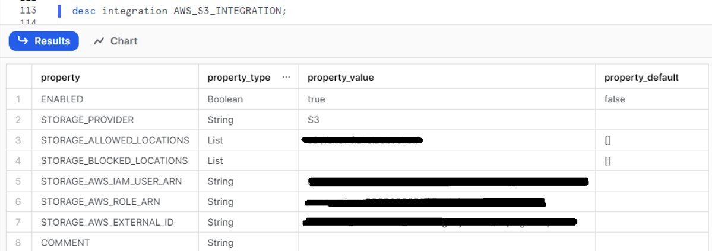

3.  AWS trust policy adjusted to Snowflake credentials
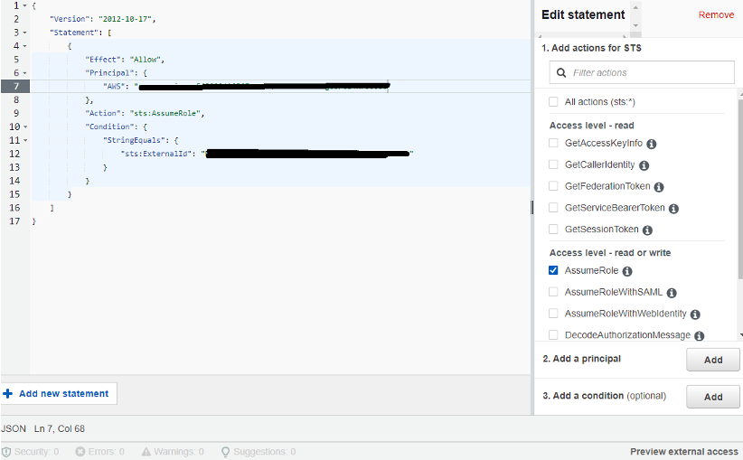

### Placing source files to S3
1.  Move files to S3
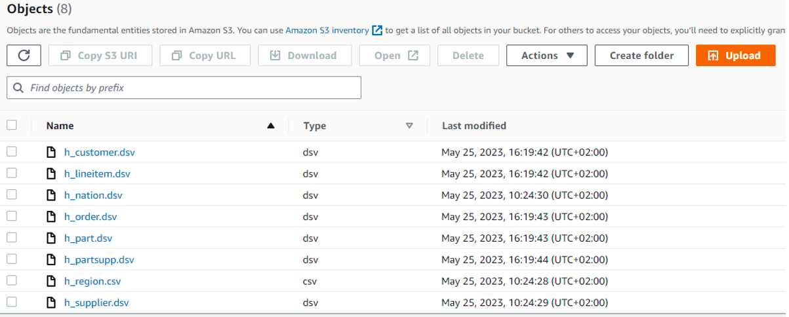

2.  Creation of CORE_DWH schema and tables within
1.1.0__Tables_creation.sql

3.  Create stage for S3
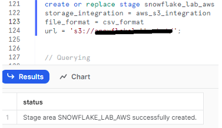

4.  Check content of the stage
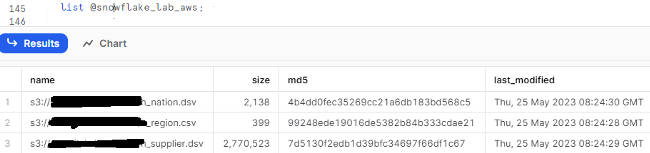

5.  Creation of Snowflake file format
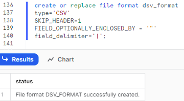

6.  Peaking the data from stage
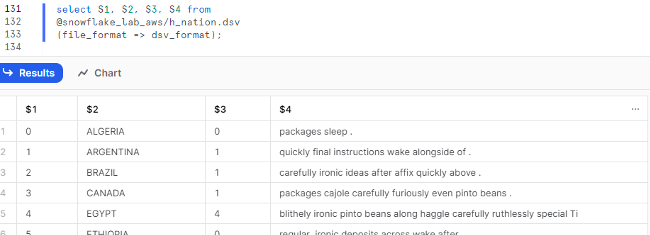

### Preparation for ETL process

1.  Prepare query to ingest data
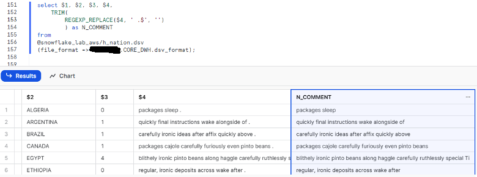

2.  Prepare query that cleans data

3.  Prepare Stage Procedures to ingest data from Stage to CORE_DWH schema from each file to according table
`1.1.1__SP_S3_to_CoreDWH.sql`
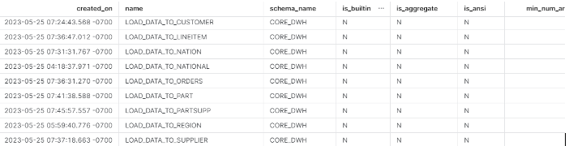

4.  Creation of one stored procedure to “rule them all” and automate data movement from Stage to CORE_DWH.
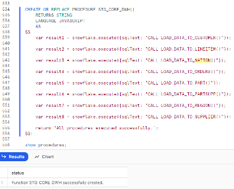

5.  Creation of streams for tables in CORE_DWH
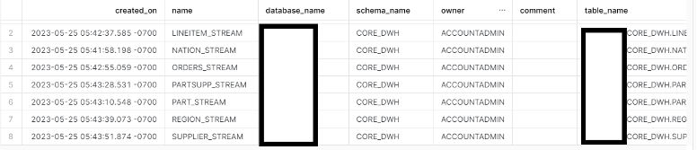

6.  Creation of tables based on Star Schema in DATA_MART
`1.1.2__Tables_creation_DATA_MART.sql`
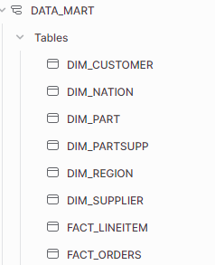

7.  Creation of Stored Procedures to move data from CORE_DWH to DATA_MART with changed schema.
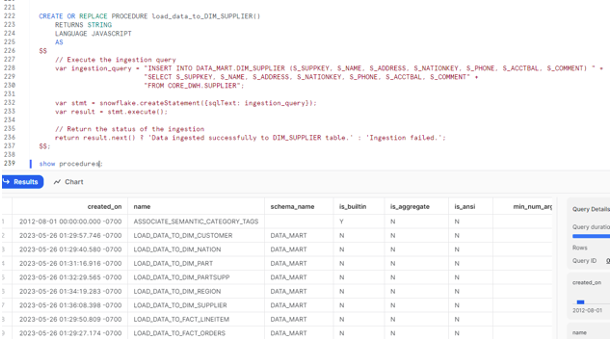

8.  Creation of one procedure to move CORE_DWH to DATA_MART
`1.1.3__SP_CoreDWH_to_DATA_MART.sql`
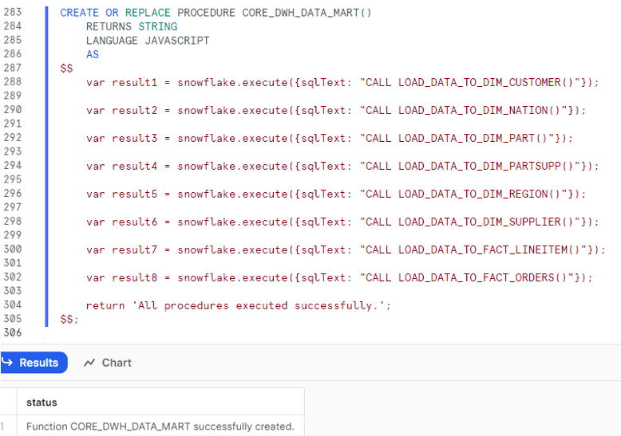

9.  Creation of streams in DATA_MART.
`1.1.4__Streams.sql`
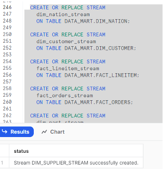

10.  Create task to navigate all the data movement.
`1.1.5__ETL_Tasks.sql`
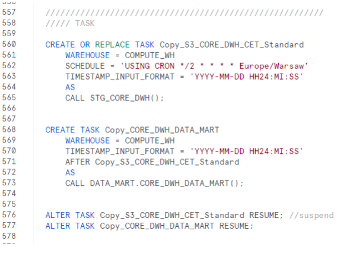

20.	Connecting Snowflake as a data source to PowerBI and creation of a simple dashboard.
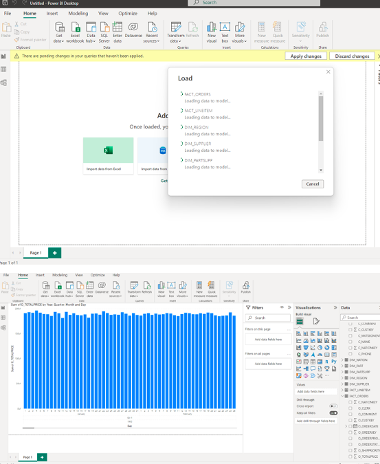