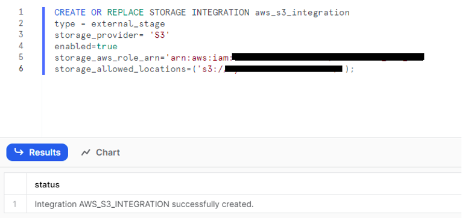

# General descrition of this project
This repository consist of a results of ETL project using S3 and Snowflake.

## Goal of this repository:
- Practice ETL process using S3 & Snowflake
- Practice integration between S3 and Snowflake
- Explore Snowflake's features like: Tasks, Stored Procedures etc. 

### Setup AWS
1.  Creation of S3 to put there files

2.  Creation of policies to integrate S3 with Snowflake

3.  Creation of role for Snowflake

4.  Assigning created policy to the role

### Setup Snowflake & AWS integration
1.  Creating Snowflake & AWS Storage integration

2.  Getting Snowflake credentials for integration

3.  AWS trust policy adjusted to Snowflake credentials

### Placing source files to S3
1.  Move files to S3

2.  Creation of CORE_DWH schema and tables within
1.1.0__Tables_creation.sql

3.  Create stage for S3

4.  Check content of the stage

5.  Creation of Snowflake file format

6.  Peaking the data from stage

### Preparation for ETL process

1.  Prepare query to ingest data

2.  Prepare query that cleans data

2.  Prepare Stage Procedures to ingest data from Stage to CORE_DWH schema from each file to according table
`1.1.1__SP_S3_to_CoreDWH.sql`

